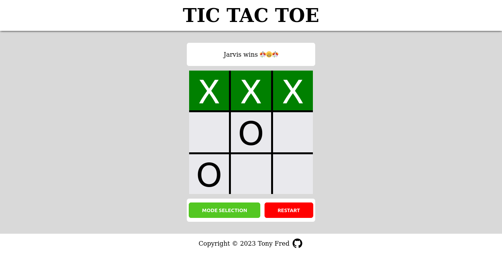

# Tic-Tac-Toe

Tic-Tac-Toe is a classic two-player game implemented in JavaScript. This project allows you to play Tic-Tac-Toe in your web browser.
This was created as a project in the [JavaScript Path of The Odin Project](https://www.theodinproject.com/lessons/node-path-javascript-tic-tac-toe)

## Table of Contents

- [Demo](#demo)
- [Features](#features)
- [How to Play](#how-to-play)
- [Contributing](#contributing)
- [License](#license)
- [Acknowledgments](#acknowledgments)

## Demo

You can play the game live at [Tic-Tac-Toe Demo](https://tonyfred-code.github.io/project-tic-tac-toe/).

## Features

- Classic Tic-Tac-Toe gameplay.
- Two-player mode.
- Player vs Computer (easy) mode.
- Player vs Computer (hard - unbeatable) mode
- Responsive design for various screen sizes.

## How To Play

- Open the game in your web browser.
- Two players take turns to click on an empty cell on the game board.
- The first player to form a horizontal, vertical, or diagonal line of their marker (X or O) wins the game.
- If the game board is filled, and no player has won, the game ends in a draw.

## Contributing

 Contributions are welcome! If you'd like to contribute to this project, please follow these guidelines:

 1. Fork the repository.
 2. Create a new branch for your feature or bug fix.
 3. Make your changes and commit them.
 4. Push your changes to your fork.
 5. Create a pull request.

## License

 This project is licensed under the [MIT LICENSE](./LICENSE)

## Acknowledgments

  Due to the complexity surrounding minimax alpha-beta pruning algorithm. I can't but acknowledge the creators of contents i read on the topic

  From Wikipedia to YouTube creators. A big thanks.
